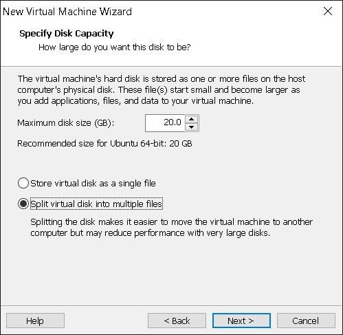

# TUGAS 1 PKSJ Uji Penetrasi

## A.Pendahuluan

## B.Install Ubuntu Server
Menginstal Ubuntu server sebagai OS yang menjadi target penetrasi
Dibawah ini ada langkah-langkah penginstalan dalam bentuk screenshot

## C.Install Kali Linux
Melakukan penginstalan kali linux sebagai OS yang akan di gunakan untuk melakukan penetrasi.
Dibawah ini ada langkah-langkah penginstalan dalam bentuk screenshot

## D.Instalasi Open SSH server
## E.Uji Penetrasi 1

## F.Konfigurasi SSH

## G.Uji Penetrasi 2

