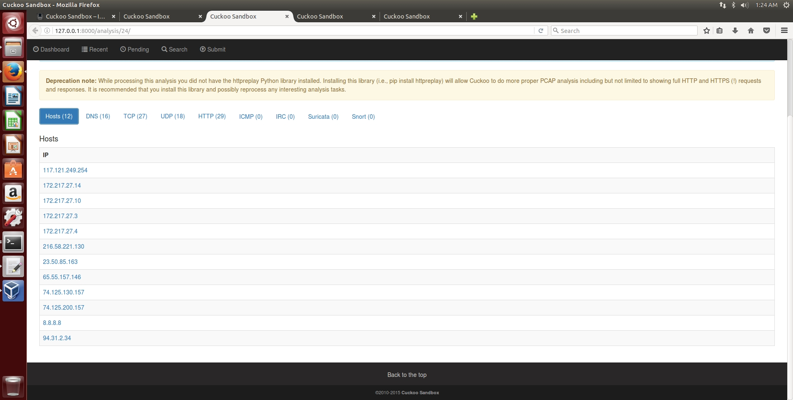

# TUGAS 3 PKSJ Analisis Malware

## A. Pendahuluan

#### Penjelasan Tugas

* Install Cuckoo Sandbox
* Analisislah malware yang terdapat pada file dengan tipe berikut:
Kelompok 1-3: .doc
Kelompok 4-6: .pdf
Kelompok 7-9: .xls
**Kelompok 10-12: .exe**
Kelompok 13: malicious URL
* Tambahan nilai jika menganalisis malware lebih dari dua


**Anggota Kelompok**

| NRP         | Nama                 |
|-------------|----------------------|
| 5113100006  | Aldhiaz Fathra Daiva |
| 5113100119  | Rezky Budi Prasetyo  |
| 5113100174  | Armirara Refa        |


## B. Dasar Teori

**1. OS yang digunakan**

* **Ubuntu** adalah sistem operasi Linux berbasis Debian yang di gunakan pada PC. Terdapat edisi lain seperti yang digunakan pada tablet dan smartphone, yaitu  Ubuntu Touch; dan juga yang menjalankan server jaringan, yaitu edisi Ubuntu Server. Perangkat lunak ini gratis dan dinamakan dari filosofi Afrika Selatan yang secara harfiah berarti 'kemanusiaan'.  Ubuntu merupakan salah satu sistem operasi yang paling populer di kalangan pengguna sistem operasi Linux. ([sumber](https://en.m.wikipedia.org/wiki/Ubuntu_(operating_system)))

* **Windows XP** adalah sistem operasi untuk PC yang diproduksi oleh Microsoft sebagai bagian dari keluarga sistem operasi Windows NT. Nama "XP" adalah kepanjangan dari "Experience". Sistem operasi ini dirilis untuk manufaktur pada 24 Agustus 2001, dan dirilis secara umum untuk dijual pada 25 Oktober 2001. Windows XP memperkenalkan grafis antarmuka pengguna yang didesain ulang secara signifikan dan merupakan versi pertama Windows yang menggunakan aktivasi produk sebagai usaha untuk mengurangi pelanggaran hak cipta. ([sumber](https://en.m.wikipedia.org/wiki/Windows_XP))


**2. Tools yang digunakan**

* **Cuckoo Sandbox** secara singkat adalah sistem untuk menganalisis malware. Kita dapat melempar semua aplikasi mencurigakan ke sana dan dalam hitungan detik Cuckoo akan memberikan uraian detail mengenai apa yang dilakukan file tersebut saat dieksekusi di dalam lingkungan yang terisolasi. ([sumber](https://cuckoosandbox.org))

**3. Malware**

* **Malware**, kependekan dari Malicious Software, adalah istilah umum yang digunakan untuk merefer sejumlah variasi bentuk dari perangkat lunak yang mengganggu dan tidak bersahabat, termasuk virus komputer, worm, trojan horse, ransomware, spyware, adware, scareware, dan program jahat lainnya. Perangkat lunak ini dapat berbentuk kode yang dapat dieksekusi, script, konten aktif, dan sebagainya. ([sumber]())

* Kami menganalisa malware jenis executable, yaitu file malware dengan extensi **.exe**. .exe merupakan extensi dari nama file yang umum, mendenotasikan file yang dapat dieksekusi pada sistem operasi DOS, OpenVMS, Microsoft Windows, Symbian atau OS/2. Selain program yang dapat dieksekusi, banyak file .exe yang mengandung komponen lainnya disebut resources, seperti grafis bitmap dan icon yang program tersebut ginakan sebagai grafis antarmuka pengguna. ([sumber]())


## C. Penjelasan Instalasi

Install Python di Ubuntu.
```$ sudo apt-get install python```

Install Sql Alchemy. SqlAlchemy dibutuhkan sebagai database toolkit dari Python.
```$ sudo apt-get install python-sqlalchemy```

atau

```$ sudo pip install sqlalchemy```

Install dependennsi-dependensi yang akan dibutuhkan.
* dpkt
* jinja2
* magic
* ssdeep
* pydeep
* pymongo
* yara and yara python:
* libvirt: This library is optional and it uses the KVM machine manager
* bottlepy: This library is optional and it uses the web.py and api.py utilities
* pefile

```$ sudo apt-get install python-dpkt python-jinja2 python-magic python-pymongo python-libvirt python-bottle python-pefile ssdeep```

atau

```$ sudo pip install dpkt jinja2 pymongo bottle pefile```

Install lagi beberapa dependensi yang akan dibutuhkan.
* Build-essential
* Git
* Libpcre3
* Libpcre3-dev
* Libpcre++-dev

```$ sudo apt-get install build-essential git libpcre3 libpcre3-dev libpcre++-dev```

Clone pydeep dari sumber git nya.
```$ cd /opt```
```$ git clone https://github.com/kbandla/pydeep.git pydeep```
```$ cd /opt/pydeep/```

python setup.py build
sudo python setup.py install

Install yara untuk mengategorikan sampel malware (taruh di folder /opt).
```$ sudo apt-get install automake -y```
```$ cd /opt```
```$ svn checkout http://yara-project.googlecode.com/svn/trunk/yara```
```$ cd /opt/yara```
```$ sudo ln -s /usr/bin/aclocal-1.11 /usr/bin/aclocal-1.12```
```$ ./configure```
```$ make```
```$ sudo make install```
```$ cd yara-python```
```$ python setup.py build```
```$ sudo python setup.py install```

 Install tcpdump untuk men-dump trafik jaringan yang terjadi saat analisis.
 $ sudo apt-get install tcpdump

## C. Analisis Malware

**1. Pdf Creator.exe**


**2. zip.exe**


**3. TORCHSETUP-R20-N-BC.exe**





## D. Kesimpulan dan Saran